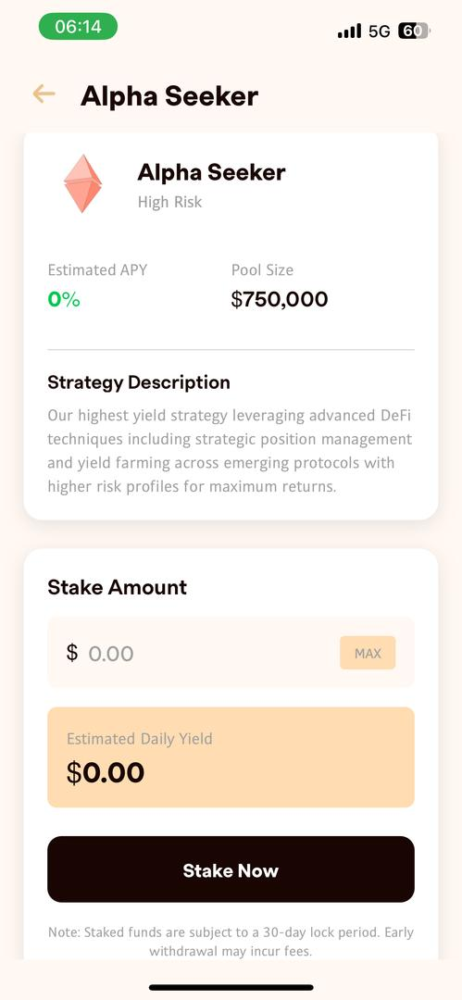

# Polystream Frontend

Polystream is a mobile application that helps users optimize their crypto earnings with smart yield strategies, requiring zero knowledge of DeFi protocols and Web3 knowledge.

<p align="center">
  
</p>

## Features

- **Simplified DeFi Access**: Invest in yield-generating strategies without deep crypto knowledge
- **Signatureless & Gasless Transactions**: Enhanced UX with no need to sign every transaction or pay gas fees
- **Risk-Categorized Vaults**: Choose from low, medium, and high risk vaults
- **Fiat On/Off Ramp**: Easily convert between fiat and cryptocurrency
- **AI Assistant**: Stake quickly with the help of AI chatbot.
- **Maximum Return**: Auto-harvest & compound your assets.
- **Smart Contract Security**: Verified vault contracts for maximum security

## Quick Start

### Prerequisites

- Node.js (v16 or higher)
- npm or yarn
- iOS/Android development environment setup

### Installation

1. Clone the repository
```bash
git clone https://github.com/polystream-core/polystream-frontend.git
cd polystream-frontend
```

2. Install dependencies
```bash
npm install
# or
yarn install
```

3. Create an environment file
Create a `.env` file in the root directory. Please contact the development team to get the required environment variables. 

4. Start the development server
```bash
npx expo start
```

5. Run on your preferred platform
```bash
# iOS
npx expo run:ios

# Android
npx expo run:android
```

## Main Screens

### Sign In Page
<p align="center">
  
</p>

The sign-in screen provides seamless authentication powered by Privy. Users can log in using their email address for a smooth onboarding experience.

### Fiat On/Off Ramp
<p align="center">
  
</p>

Easily convert between fiat currencies and cryptocurrencies to fund your yield strategies or withdraw your earnings, no complex swapping/bridging needed.

### Portfolio Page
<p align="center">
  
</p>

Track your total balance and yield accrued.

### Markets Page
<p align="center">
  
</p>

The Markets page displays available yield strategies categorized by risk level:
- Conservative Yield (Low Risk): Stable yields through diversified lending protocols
- Balanced Growth (Medium Risk): Optimized for consistent returns with moderate risk
- Alpha Seeker (High Risk): High risk, high reward.

### Vault Details
<p align="center">
  
</p>

Detailed information about each vault including:
- Current APY
- Total Assets Under Management
- Strategy description
- Withdraw functionality

### Staking Page
<p align="center">
  
</p>

View your active investments, accrued yields, and manage your staked assets in one convenient dashboard.

### AI Chat Assistant
<p align="center">
  
</p>

Get instant help and quick access to depositing and withdrawing with AI-powered assistant.

## Tech Stack

- **Frontend**: React Native with Expo
- **Authentication**: Privy
- **On-off ramp**: Transak
- **Blockchain**: Scroll, Base
- **Smart Contracts**: Solidity


### Project Structure

```
polystream/
├── app/                 # Expo Router screens
│   ├── (tabs)/          # Tab navigation screens
│   ├── modals/          # Modal screens
│   └── index.js         # Entry point
├── src/
│   ├── assets/          # Images, fonts, etc.
│   ├── components/      # Reusable components
│   ├── constants/       # App constants (colors, fonts)
│   ├── contracts/       # Contract ABIs and addresses
│   ├── hooks/           # Custom React hooks
│   └── utils/           # Utility functions
├── .env                 # Environment variables
└── package.json         # Dependencies
```

## Documentation

For comprehensive documentation about Polystream, please visit our GitBook:
[https://docs.polystream.xyz/](https://docs.polystream.xyz/)

## License

This project is licensed under the MIT License - see the LICENSE file for details.

## Support

For support, please reach out to us on Twitter at [https://x.com/polystream_xyz](https://x.com/polystream_xyz).